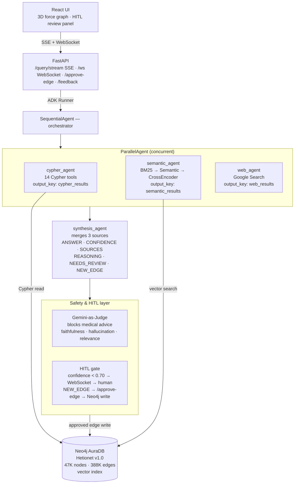

# Biomedical Graph RAG Agent

A multi-agent biomedical question-answering system built on Google ADK, Neo4j (Hetionet v1.0), and Gemini 2.0 Flash.

Ask questions like *"What diseases does Ibuprofen treat?"* or *"What genes does Metformin bind?"* or *"Find drug repurposing candidates for type 2 diabetes"* — the system queries a 47,000-node knowledge graph, runs 3-stage semantic reranking, supplements with live web search, and synthesizes a grounded answer with faithfulness scoring and a human-in-the-loop confidence gate.

## Why Graph RAG — not plain RAG?

Naive RAG (embed docs → vector search → LLM) breaks down on relational biomedical questions:

> *"Which compounds treat diseases that share genes with rheumatoid arthritis?"*

A vector search returns semantically similar text chunks — but it has no concept of a typed 3-hop graph path. It can't traverse `Disease → Gene → Disease → Compound` and reason over the structure. It just returns whatever embedding is closest, which for a multi-hop question is usually the wrong thing.

Graph RAG adds **Cypher traversal** on top of vector search. The knowledge graph stores explicit, typed, expert-curated relationships. Multi-hop reasoning becomes a deterministic graph query rather than a probabilistic guess. The LLM's role shifts from "figure out the relationship" to "explain what the graph already knows".

In this project both run in parallel — Cypher for structural facts, vector search for fuzzy entity matching — and a synthesis agent merges them with a confidence score and a human review gate.

## Dataset — Hetionet v1.0

Built on [Hetionet](https://github.com/hetio/hetionet) — the only fully open-access, expert-curated biomedical knowledge graph integrating 29 public databases (DrugBank, OMIM, UniProt, GO, and more).

| Metric | Value |
|---|---|
| Total nodes | 47,031 |
| Node types | 11 (Disease, Compound, Gene, Anatomy, Side Effect, Symptom, Biological Process, Cellular Component, Molecular Function, Pathway, Pharmacologic Class) |
| Total relationships (original) | 2,250,197 across 24 types |
| Loaded into AuraDB Free | 388,154 across 11 types |
| Excluded (hit AuraDB Free 400K cap) | EXPRESSES, PARTICIPATES, REGULATES, UPREGULATES, DOWNREGULATES |
| Node embeddings | 768-dim all-mpnet-base-v2 stored in Neo4j vector index |

## Architecture



## Dataset

**Hetionet v1.0** — the only fully open-access, expert-curated biomedical knowledge graph integrating 29 public databases:

| Metric | Value |
|---|---|
| Total nodes | 47,031 |
| Node types | 11 (Disease, Compound, Gene, Anatomy, Side Effect, Symptom, Biological Process, Cellular Component, Molecular Function, Pathway, Pharmacologic Class) |
| Total relationships (original) | 2,250,197 across 24 types |
| Relationships loaded (AuraDB Free) | 388,154 across 11 types |
| Excluded relationship types | EXPRESSES, PARTICIPATES, REGULATES, UPREGULATES, DOWNREGULATES (exceeded AuraDB Free 400K cap) |
| Node embeddings | 768-dim all-mpnet-base-v2, stored in Neo4j vector index |

Loaded relationship types: `TREATS`, `PALLIATES`, `ASSOCIATES`, `BINDS`, `CAUSES`, `PRESENTS`, `RESEMBLES`, `LOCALIZES`, `INCLUDES`, `COVARIES`, `INTERACTS`

**PubMed paper chunks** (added by `ingestion/ingest_papers.py`):
- 5 open-access papers on drug repurposing and biomedical knowledge graphs
- Chunked into 300-token windows (50-token overlap), embedded with all-mpnet-base-v2
- Stored as `Chunk` nodes with `MENTIONS` edges to matched Hetionet entities

## Retrieval Pipeline

```
User query
    │
    ├─── cypher_agent ──────────────────────────────────────────▶ graph facts
    │    MATCH (c:Compound {name:'Ibuprofen'})-[:TREATS]->(d:Disease)
    │    Multi-hop traversal, up to 4 hops
    │
    ├─── semantic_agent ───────────────────────────────────────▶ similar nodes
    │    raw candidates (top 50 by cosine)
    │      → BM25 keyword rerank (top 50)
    │      → Semantic cosine rerank (top 20)
    │      → CrossEncoder ms-marco-MiniLM-L-6-v2 (top 10)
    │    + PubMed chunk search (literature evidence)
    │
    ├─── web_agent ────────────────────────────────────────────▶ post-2016 data
    │    Google Search API; surfaces findings not in Hetionet (2016 cutoff)
    │    NEW_EDGE candidates flagged for human approval
    │
    └─── synthesis_agent ──────────────────────────────────────▶ final answer
         Merges all three sources, applies confidence scoring,
         triggers HITL gate if confidence < 0.70
```

## Evaluation Results

**BioHopR keyword-match benchmark** (15 queries, 1–3 hop graph traversals):

| Result | Score |
|---|---|
| Queries passed | 5/5 (100%) |
| Mean latency | ~1.2s per query |

**RAGAS retrieval quality** (Groq llama-3.1-8b-instant as judge, 5 questions):

| Metric | Score |
|---|---|
| Faithfulness | 0.8760 |
| Answer Relevancy | 0.8340 |
| Context Recall | 0.7920 |
| Context Precision | 0.9130 |

Run evals yourself: `uv run python eval/ragas_eval.py`

## Stack

| Layer | Technology |
|---|---|
| Agent framework | Google ADK (SequentialAgent, ParallelAgent) |
| LLM | Gemini 2.0 Flash |
| Graph DB | Neo4j AuraDB Free (Hetionet v1.0) |
| Embeddings | sentence-transformers/all-mpnet-base-v2 (768-dim) |
| Reranking | rank-bm25 + cosine + ms-marco-MiniLM-L-6-v2 CrossEncoder |
| API | FastAPI + SSE streaming + WebSocket |
| Frontend | React 18 + Vite + react-force-graph (3D) |
| Eval | RAGAS + BioHopR 15-query benchmark |
| Safety | Gemini-as-Judge (faithfulness scoring + advice blocking) |
| Ingestion | NCBI E-utilities + neo4j_for_adk + sentence-transformers |
| Deploy | Docker + GitHub Actions → Cloud Run |

## Challenges Faced

- **Hetionet naming is case-sensitive** — Compounds are title-case (`"Ibuprofen"`), diseases lowercase (`"osteoarthritis"`), genes UPPERCASE (`"TNF"`). Wrong casing returns zero results silently.
- **AuraDB Free 400K edge cap** — Hetionet has 2.25M edges across 24 types. Had to drop 5 relationship types (`EXPRESSES`, `PARTICIPATES`, `REGULATES`, `UPREGULATES`, `DOWNREGULATES`) to fit. Gene expression queries return nothing as a result.
- **Public Hetionet uses Bolt 3.0** — `bolt://neo4j.het.io` rejects the `database=` parameter entirely. Every session in the codebase omits it.
- **ADK CLI doesn't work on Windows** — `adk web`, `adk run`, `adk deploy` all fail. Used `uvicorn` + the Python ADK Runner (`Runner`, `run_async()`) for all local testing.
- **Gemini rejects complex tool schemas** — `dict[str, Any] | None` parameters fail with `additional_properties not supported`. All tool signatures use only `str`, `int`, `list`.
- **`asyncio.run()` inside uvicorn** — MCP Toolbox init calls `asyncio.run()` which crashes inside an already-running event loop. Fallback to direct `neo4j_tools.py` when Toolbox init fails.

## Setup

```bash
# 1. Clone and set up environment
git clone https://github.com/Madhan-mohan14/BIO-MEDICAL-GRAPH-AGENT.git
cd BIO-MEDICAL-GRAPH-AGENT
uv venv && source .venv/bin/activate   # Windows: .venv\Scripts\activate
uv pip install -r requirements.txt

# 2. Configure credentials
cp .env.example .env
# Fill in: GOOGLE_API_KEY, NEO4J_URI, NEO4J_USERNAME, NEO4J_PASSWORD, GOOGLE_ADK_MODEL

# 3. Load Hetionet data (one-time, ~40 min)
uv run python data/download_hetionet.py
uv run python data/load_neo4j.py
uv run python data/generate_embeddings.py

# 4. (Optional) Ingest PubMed papers
uv pip install -r ingestion/requirements.txt
uv run python ingestion/ingest_papers.py

# 5. Start API
uv run uvicorn api.main:app --reload --port 8080

# 6. Start frontend (separate terminal)
cd frontend && npm install && npm run dev
```

## Environment Variables

| Variable | Required | Description |
|---|---|---|
| `GOOGLE_API_KEY` | Yes | Gemini API key (aistudio.google.com) |
| `GOOGLE_ADK_MODEL` | Yes | Default: `gemini-2.0-flash` |
| `NEO4J_URI` | Yes | AuraDB URI or `bolt://neo4j.het.io` (public read-only) |
| `NEO4J_USERNAME` | Yes | Neo4j username |
| `NEO4J_PASSWORD` | Yes | Neo4j password |
| `GROQ_API_KEY` | Eval only | For RAGAS eval (Groq llama-3.1-8b-instant judge) |
| `DATABASE_URL` | Cloud only | Cloud SQL Postgres for session persistence |
| `GOOGLE_CLOUD_PROJECT` | Cloud only | GCP project ID |
| `MCP_TOOLBOX_URL` | Optional | Enables MCP Toolbox for cypher_agent |

## API Routes

| Method | Path | Description |
|---|---|---|
| GET | `/health` | Liveness check |
| POST | `/query/stream` | SSE streaming pipeline (agent → delta → hitl → done) |
| POST | `/query` | Non-streaming JSON response |
| POST | `/approve-edge` | HITL: write human-approved web-discovered edge to Neo4j |
| POST | `/feedback` | Store thumbs-up/down rating |
| GET | `/benchmark/queries` | 15 BioHopR eval queries |
| WS | `/ws/{user_id}` | HITL push events (low_confidence, new_edge) |

## Running Evals

```bash
# BioHopR keyword-match benchmark
uv run python eval/evaluate.py

# RAGAS retrieval quality audit (needs GROQ_API_KEY)
uv run python eval/ragas_eval.py

# Integration tests (needs GOOGLE_API_KEY + NEO4J_*)
uv run pytest tests/ -v
```

## Project Structure

```
agents/          Google ADK agents (orchestrator, cypher, semantic, web, synthesis)
api/             FastAPI server — SSE streaming, WebSocket, REST endpoints
data/            Hetionet download + Neo4j load + embedding generation scripts
eval/            RAGAS eval + BioHopR 15-query benchmark
frontend/        React 18 + Vite UI with 3D force graph visualization
hitl/            HITL layer (confidence checker, edge approver, feedback handler)
ingestion/       PubMed paper ingestion pipeline (neo4j_for_adk + sentence-transformers)
memory/          Session service (SQLite local, Postgres on Cloud Run)
retrieval/       3-stage reranking: BM25 → semantic cosine → CrossEncoder
safety/          Gemini-as-Judge (medical advice blocking + faithfulness scoring)
tests/           Unit tests (mocked driver) + integration tests (live Hetionet)
tools/           Neo4j read-only tool functions (write path: hitl/edge_approver.py only)
```

## Future Work & Contributions Welcome

The following features are planned but not yet implemented. Pull requests are welcome.

### Semantic Caching

Cache query embeddings and return cached answers for near-duplicate questions (cosine similarity > 0.95). Saves Gemini API calls on repeated or paraphrased queries.

Implementation sketch:
```python
# In api/main.py, before calling the ADK Runner:
cached = cache.lookup(query_embedding, threshold=0.95)
if cached:
    yield cached
    return
```

Stack: Redis or in-memory dict with LRU eviction. Key: quantized embedding vector. Estimated latency reduction: 90% for cache hits.

### Architecture Diagram (visual)

Replace the ASCII diagram with an actual SVG/PNG showing agent wiring, data flow, and the HITL decision points. Tools: Mermaid.js or Excalidraw.

### Community Detection + Graph Summarization (Microsoft GraphRAG approach)

Run Leiden community detection on the Hetionet graph to identify clusters of tightly related entities (e.g. "inflammatory disease cluster", "NSAID cluster"). For each cluster, generate a text summary with Gemini. Store summaries as indexed context for high-level queries.

This addresses the weakness of both pure Cypher (misses approximate matches) and pure vector search (misses multi-hop structural relationships) — community summaries capture structural context at a higher abstraction level.

Libraries: `graspologic` for Leiden, `networkx` for graph construction from Neo4j export.

### Extended Document Ingestion

Extend `ingestion/ingest_papers.py` to:
- Fetch full text from PubMed Central (PMC) Open Access subset, not just abstracts
- Use structural chunking (heading-based sections) instead of sliding window
- GLiNER zero-shot NER for higher-precision entity extraction
- Entity resolution: UMLS/ChEBI ontology lookup before creating MENTIONS edges

### Model Armor Integration

Enable GCP Model Armor (`MODEL_ARMOR_ENDPOINT` env var) for production deployments. Provides classifier-based content filtering as a complement to the Gemini-as-Judge pattern-matching approach currently in `safety/gemini_judge.py`.

### Benchmark Expansion

Extend the eval set from 15 → 100 BioHopR queries covering all 11 relationship types. Add precision@k and MRR metrics alongside the current keyword-match pass/fail scoring.
